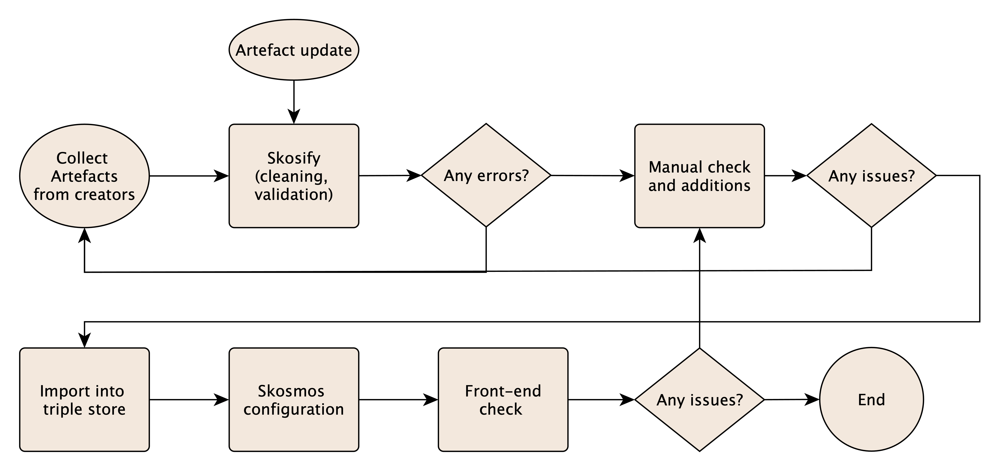
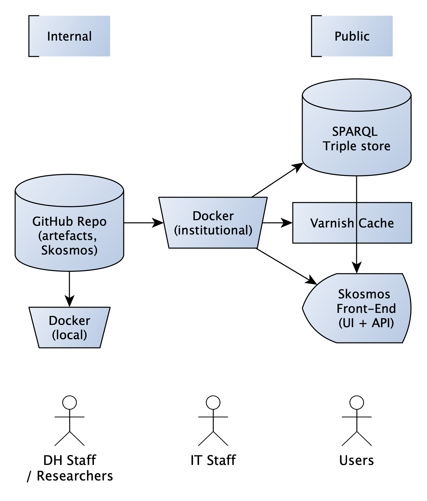

# Contributing to /DH.arc Vocabularies 🤝🏻

In this document you'll find guidelines for contributing to the /DH.arc Vocabularies repository. The primary type of contributions this document covers are as follows:
- preparing and/or adding new semantic artefacts to the repository 
    - incl. converting ontologies formatted in OWL to SKOS for inclusion in the repository
- updating existing semantic artefacts  
- updating the repository's core files (e.g. to add new content, pages, CSS styles etc)

In addition this document also covers how to install a local version of the repository on your machine which can be used for any of the above contributions. 

As of 2026 this repository is overseen and maintained by: 
- Laurent Fintoni (laurent.fintoni2@unibo.it), primary point of contact for preparation and creation of vocabularies, ontology conversion, and interface updates as well as troubleshooting for local installations.
- Tommaso Vitale (tommaso.vitale@unibo.it), primary point of contact for updates and additions to the live site.

Quick Topic Links (click to jump to a section): 
[Prepating a new semantic artefact for inclusion](#1) 
[Adding a new semantic artefact to the repository](#2) 
[Hosting the artefact and updates](#3) 
[Updating the Skosmos config file](#4) 
[Updating the load script](#5) 
[Installing a local instance of Skosmos (dev/testing)](#6) 
[Converting OWL ontologies to SKOS](#7) 
[Repository structure](#8) 

## Preparing a new semantic artefact for inclusion ✍🏻

The repository runs on [Skosmos](https://skosmos.org/), a web based open-source ontology browser developed and released by the team at the National Library of Finland, which uses SKOS as the underlying data model. As such any semantic artefact intended for inclusion in the repository must be formatted in [SKOS](https://www.w3.org/TR/skos-reference/). The easiest, and likely common, example is that of a controlled vocabulary such as a taxonomy or thesaurus. 

Skosmos does support the use of non-SKOS properties from common ontologies and data models such as Dublin Core, DCAT, PROV-O, OWL, and FOAF. If your artefact includes classes or properties from specific models/ontologies outside of SKOS you can still have display these within Skosmos by doing the following: 
- for classes ensure that the external model/ontology is defined in the prefixes (e.g. <code>@prefix fabio: <http://purl.org/spar/fabio/></code>) and then state this prefix as an import with the <code>owl:import</code> property, which will allow Skosmos to create a correct URI for the class (this URI will redirect if the external model/ontology has a redirection system in place).
- for properties you must define them in the file with an <code>rdfs:label</code>, see example below. 

<i>Example of an external property defined for display via the Skosmos interface:</i> 
<code>
rdfs:domain a rdf:Property ; 
    rdfs:label "domain"@en, "dominio"@it ; 
    skos:definition  "A domain of the subject property."@en, "Il dominio della proprietà."@it . 
</code>

Please see the [Skosmos documentation](https://github.com/NatLibFi/Skosmos/wiki/Data-Model) on Data Model for further details of such inclusions as well as any of the converted OWL ontologies we make available, SKOS versions of which can be found in the ontologies_skos folder of this repository. 

We recommend that semantic artefacts intended for inclusion be written in the [Turtle RDF syntax](https://www.w3.org/TR/turtle/) (file type .ttl), though other conventions can also be used if needed. Direct links to external files written in RDF and/or OWL (for reference) can be included by use of the DCAT download property within the SKOS conceptScheme class. See the converted [Historical Context Ontology](https://lab.dharc.unibo.it/skosmos/hico/en/) for reference.  

All artefacts should ideally be made available in both English and Italian, as these are the official languages of the repository. This means that the artefact should include translations of string objects in each language for all classes and, where applicable, properties. It is possible to add an artefact in only one language, however this will make its contents inaccesible to users browsing in the unavailable language. If that is the case it is recommended to include a translation of the artefact's metadata (all properties under <code>skos:ConceptScheme</code>) in the Skosmos config file (see next section) in the unavailable language so that a user may at least see that the artefact is available in the other language as well as view basic details about it. See the Italian page for the [WRITE Thesaurus](https://lab.dharc.unibo.it/skosmos/wt/it/), which is currently only available in English as an example.   

/DH.arc Vocabularies does not provide editing functionalities meaning the artefact you want to add MUST be created using an external software or system of your choice. Below are some of the most useful tools we know of to help you create, prepare, and validate the artefact and ensure its compatibility with our system: 
- [Skosify](https://github.com/NatLibFi/Skosify), a Python library built by the same team behind Skosmos which takes OWL, RDFS, and SKOS vocabularies as input and automatically cleans them up and aligns them to best practices. Skosify can be used to quickly convert a non-SKOS file to Skosmos-friendly formats.
- [SKOS Play](https://skos-play.sparna.fr/play/), a browser-based set of tools for creating SKOS files (including from spreadsheets), as well as validate them. The validator is our recommended choice for ensuring that your semantic artefact complies as best as possible to the SKOS data model. 
- [BARTOC Knowledge Organization Systems report](https://gbv.github.io/bartoc-vocabulary-software/), a regularly updated report that details existing software for the creation of KOS, useful if you are looking for a specific tool with which to create semantic artefacts. 

You can refer to the [KNOT Taxonomy](https://raw.githubusercontent.com/icdp-digital-library/KNOT/refs/heads/main/data_model/controlled_vocabularies/1.5/ktx.ttl) as a SKOS-formatted controlled vocabulary that displays and interacts correctly withing /DH.arc Vocabularies. 

Our recommended process for preparing your semantic artefact for inclusion into the repository is as follows (this process also applies to artefacts sent directly to /DH.arc for inclusion where the author(s) are not able to prepare it beforehand):   

1️⃣ Prepare and/or update the artefact   
➡️ 2️⃣ Validate (see above for validation tools)   
➡️ 3️⃣ Any errors? If yes go back to step 1, if no go to step 4   
➡️ 4️⃣ The artefact is ready to be added to the repository   
✅ 

## Adding a new semantic artefact to the repository ✅

Adding a new semantic artefact to /DH.arc Vocabularies should be done via a testing stage (detailed below). If you are unable to test yourself you can contact Laurent Fintoni who will handle the testing. 

For addition the following are required: 
- A validated SKOS-formatted semantic artefact (see previous section)
    - An existing host for the semantic artefact, e.g. GitHub or a private server
- An update to the Skosmos config file that describes the artefact, required for the artefact to correctly display in the repository 
- An update to the .sh loading file, required to pull the artefact into the repository's graph 
- A pull request to this repository to add the new and updated files.
- An update to the live site, done by Tommaso Vitale

Below is visual summary of the publishing workflow. This includes the creation/conversion and validation steps described in the previous section and the steps described in the following sections.

In addition to the publishing process, this next diagram gives a summary of the development/testing and production setups, full details for which are included in the following sections.

### Hosting of the artefact (and subsequent updates) 🛜

Hosting of the semantic artefact should be done via your own preferred/existing system. The most common situation is that your artefact already exists elsewhere and is accessible via a direct URL, for example within a GitHub repository (in which case the direct access URL begins with raw.githubusercontent.com). If you cannot host your own artefact, we can host it on our GitHub. Please contact Laurent Fintoni first in this case. 

To add the artefact we will download a local copy for back-up and then POST it in the triple store using the live URL to populate the graph. This means that subsequent updates to the artefact can be reflected in two ways: if the update involves changes to the file but no meaningful changes to the artefact's metadata or file location we can update via simply re-running the shell script for loading (see below); if the update involves a change to the file's location or the artefact's metadata (stored in the Skosmos config file) we update via the full update process. 

Currently, OWL ontologies converted to SKOS are hosted by DH.arc by default (in the ontologies_skos folder of this repository) while all other artefacts in the repository are hosted elsewhere by default.  

### Updating the Skosmos config file 📡

To ensure that the new artefact displays correctly on the repository an update to dockerfiles/config/config-docker-compose.ttl is required. This file contains the main configurations for the Skosmos implementation that DH.arc Vocabularies runs on. For more details on what is, and can be included in this file, see [the relevant official documentation page](https://github.com/NatLibFi/Skosmos/wiki/Configuration). 

For each new artefact added to the repository a new instance of the class <code>skosmos:Vocabulary</code> and <code>void:Dataset</code> must be created. The default example provided by Skosmos for the STW thesaurus is as follows: 

<code>:stw a skosmos:Vocabulary, void:Dataset ; 
    dc:title "STW Thesaurus for Economics"@en ; 
    skosmos:shortName "STW"; 
    dc:subject :cat_general ; 
    void:uriSpace "http://zbw.eu/stw/"; 
    skosmos:language "en", "de"; 
    skosmos:defaultLanguage "de"; 
    void:sparqlEndpoint <http://fuseki-cache:80/skosmos/sparql> ; 
    skosmos:sparqlGraph <http://zbw.eu/stw/> . 
</code>

⚠️IMPORTANT⚠️: the subject of this new instance should match the prefix of the SKOS concept scheme in the artefact. In the above example :stw is the prefix used by the STW Thesaurus for Economics in their .ttl file. In addition the subject should be a prefix rather than a URI otherwise the generated URLs for the vocabularies will use the entire URI which makes them less legible. 

There are some important properties within this instance that you should ensure are correctly set: 
<code>skosmos:language;</code> ⚠️ This should always be set to have either both or at least one of "en" and "it" as values, as these are the default languages of the repository 
<code>void:sparqlEndpoint <http://fuseki-cache:80/skosmos/sparql> ;</code> ⚠️ This should always be set to this URL 
<code>void:dataDump DIRECT LINK TO THE SOURCE FILE ;</code> ⚠️ This generates a download link for the artefact 
<code>skosmos:sparqlGraph DIRECT LINK TO THE SOURCE FILE ;</code>⚠️ This pulls the source file into the graph 

Do not forget that all URLs in Turtle must be wrapped in <>. 

In addition to the default properties required for this instantiation the following property should be added for internal styling: 
<code>skosmos:propertyLabelOverride [skosmos:property <http://www.w3.org/2004/02/skos/core#altLabel>; rdfs:label "Alternative Terms"@en];</code> 
This updates the altLabel property to display a different label on hover. 

For further details of which properties are available see the above linked documentation or take a look at the live config file (dockerfiles/config/config-docker-compose.ttl) to see examples of how each existing artefact is instantiated on the repository. The primary points of consideration are as follows: 
- Which category should be used? 
    - By default new artefacts should be added to a project specific category, especially when there are multiple artefacts relating to the same project. Converted OWL ontologies should be added to the ontologies category. A separate, non-project specific category for KOS does not currently exist but could be created. The process for creating new categories under which to display the artefact is similar to instantiating a new artefact, however categories are instances of <code>skos:Concept</code> that are currently declared after the artefacts (the section is marked with a comment). See the existing config file for examples of how to format new categories.
- Display options such as showing a full alphabetical index, top concepts, and which mode should be the default on access. The best way to test these options to run Skosmos locally and try them out, or reference the current config file to see how each artefact is currently set up. For artefacts with more than 20 concepts we recommend setting the <code>skosmos:fullAlphabeticalIndex</code> property to false so as to avoid the navigation column becoming unwieldy for front-end users (the column will instead use an index). For artefacts that make use of <code>skos:Collection</code> we recommend setting <code>skosmos:groupClass</code> to <code>skos:Collection</code> and <code>skosmos:defaultSidebarView</code> to <code>'groups'</code> which will default the user to the collections. 

Again here the existing Skosmos documentation as well as the existing config file should provide the necessary references to cover most situations.

### Updating the load script ⬆️

Lastly, the shell script used to load the vocabularies into the triple store needs to be updated with the necessary command to add the new artefact to the repository and call the relevant source file. 

This load file is contained within the /vocab_files folder which is where the repository stores local copies of each artefact as a redundancy. Every time changes are made to the repository or changes are made to the source files for the artefacts, the loading script file must be run in order to reload all vocabularies.  

The formatting for the command to add is as follows: 
<code>curl -L -o ktx.ttl https://raw.githubusercontent.com/icdp-digital-library/KNOT/refs/heads/main/data_model/controlled_vocabularies/1.5/ktx.ttl
curl -X POST -H Content-Type:text/turtle --data-binary "@ktx.ttl" "http://localhost:9030/skosmos/data?graph=https://raw.githubusercontent.com/icdp-digital-library/KNOT/refs/heads/main/data_model/controlled_vocabularies/1.5/ktx.ttl"</code>

Where: 
- the .ttl file is the name of the file being called 
- the first URL is a direct link to the source file 
- the second URL is the same but combined with the preceding localhost address (http://localhost:9030/skosmos/data?graph=)

When adding a new artefact do the following:
- Add a comment to the .sh file stating which artefact is being loaded (using the same title used in the config file)
- Add a 0.5s time out, to help ensure smooth update
- Add the command for it below 
- Save the .sh file 

## Installing a local instance of Skosmos (for testing or core file updates) 🖥️

A local instance of the /DH.arc Vocabularies repository can be installed on your machine in order to test the artefacts you wish to add or make updates to Skosmos' core files such as the CSS, php files, or twig templates. For more information on the [Skosmos architecture](https://github.com/NatLibFi/Skosmos/wiki/Backend-architecture) please see their documentation. Currently the /DH.arc Vocabularies repository runs Skosmos 2.18.1 and has been lightly modified with changes to the CSS and twig templates primarily. Updates to the core files should be managed with Laurent Fintoni. 

In order to run a local instance of the repository to test your own artefacts you need the Docker desktop application and a local copy of the GitHub repository. Please first request access to the repository from Tomasso Vitale, who can add you as a collaborator. 

Below is an example workflow for a MacOS machine running on an M1 chip, please note that machine specifications will likely require some alteration to the workflow and/or docker files. It is also recommended to do this using a code editor of your choice, such as VS Code, which can handle the necessary changes in source control, so that once your tests are complete you can push the necessary updates directly to the live repository. At which point your pull request will be reviewed and if approved merged before an update to the live site (done by Tomasso Vitale). 

⚠️IMPORTANT:⚠️
- If you encounter errors running docker compose it may be required to update the docker-compose.yml file. In the past, running docker compose on an M1 machine required the addition of the platform specification, which is no longer required. As of 2026, Docker desktop includes its own LLM assistant that can be used to diagnose any error messages. Should you require to make updates to docker-compose.yml for your own local environment these changes should be undone before sending your pull request so that they do not overwrite the .yml file used by the production environment (see below for how this is currently handled for dev vs prod requirements). 
- The docker-compose.yml and the config-docker-compose.ttl files each require a change to run locally compared to the production version. These changes are due to the fact that the live site requires reverse proxy settings to function correctly. As such docker-compose.yml contains two lines in the ports section for the skosmos image (lines 40-41): line 40 (${SKOSMOS_PORT:-9090}:80) is used for the local version, and line 41 (8083:80) is used for the live version. Meanwhile, config-docker-compose.ttl includes the following triple in the config instance (currently line 71, the last triple in the instantation of the :config individual): <code>skosmos:baseHref "https://lab.dharc.unibo.it/skosmos/".</code> This triple is required for reverse proxy on the live site but should be disabled for local versions. 
    - This means that your local versions of both files will need to comment the live requirements out and uncomment local requirements. For docker-compose.yml this means switching the comment # from one port to the other, while for config-docker-compose.ttl this means commenting the aforementioned triple out and closing the config instance at the previous triple. 
    - Once you are ready to push your changes back to the repository you must ensure that you revert these changes so that the file on the repository has the correct settings. So docker-compose.yml should have the 8083:80 port uncommented and the config-docker-compose.ttl file should have the baseHref triple uncommented (and its final dot moved back to the baseHref triple). 

1️⃣ From within the local version of the GitHub repository, open a terminal and run the "docker compose up -d" command. This requires the Docker desktop application, which will open (if not already opened) and build the necessary images and containers for the application to run locally. ⚠️ Remember to update the config files for ports and reverse proxy as detailed in the note above. It is recommended to run the local docker implementation using compose as this will create all three necessary images and containers (one for the app, one for Fuseki, and one for the Varnish HTTP cache). Please the [Skosmos documentation](https://github.com/NatLibFi/Skosmos/tree/main/dockerfiles) for more details. Your local version of the repository should now be available at localhost:9090 (or equivalent). 

2️⃣ Using your editor of choice make the necessary updates to the Skosmos config file to add the new artefact to the repository, and the necessary updates to the loading script, as detailed in the previous section. Once these changes are done open a terminal in the vocab_files folder and run the loading script (vocab_files/vocabulary_load_new.sh), which will add all existing artefacts to the triple store, including the new additions. 

3️⃣ Any changes to the config file requires a docker reload which can be done by simply running docker compose down followed by docker compose up -d (if you are also editing core files, such as php or css you will need to add the --rmi all flag to the compose down command to also remove the images and rebuild them). Once everything is working as intended locally you can send your changes to the GitHub repository via pull request. This PR will be reviewed and if accepted merged before the prod version is updated.  

## Converting OWl-formatted ontologies to SKOS 🔮

Skosmos can only display semantic artefacts formatted in SKOS, however /DH.arc members often produce ontologies formatted in OWL (Web Ontology Language) which we also want to be able to include the repository. While existing research into the combined use of SKOS and OWL is sparse, and contained during the years before and after the release of the data model in 2009, some work points clearly to the usefulness of combining the two in order to provide a navigational/browsing structure or interface for an OWL ontology that exists for a specific domain (Jupp, Bechhofer, and Stevens, 2008; Abdul Manaf, 2014). Furthermore, [this](https://www.w3.org/2006/07/SWD/SKOS/skos-and-owl/master.html) W3C document from 2008 proposes two primary design patterns for going from OWL to SKOS by either overlaying the two or transforming the former into the latter.  

As such, during development of /DH.arc Vocabularies we tested these patterns and settled on the overlay approach as this allowed us to make our ontologies viewable in the Skosmos browser while ensuring that the formal semantics they offer are still understandable to both humans and machines. As noted by the aforementioned W3C document, this approach implies two key points: the resulting version of these ontologies are necessarily OWL Full (while transformation would make them compatible with OWL DL and likely require the use of punning) and <code>skos:Concept</code> and <code>owl:Class</code> cannot be disjoint. This approach lets us provide taxonomy- or thesaurus-like representations of OWL ontologies for the specific application of enabling browsing and improving the FAIR-ness of these artefacts who are often hard to find and reuse. 

Should you wish to make an OWL-formatted ontology available via /DH.arc Vocabularies we recommend the following. You can also look at the ontologies we have already overlaid with SKOS (located at ontologies_skos within this repository) for further reference.

1️⃣ You can use the Skosify Python library to convert an OWL-formatted artefact to SKOS into a Turtle-formatted document that combines overlaying and transforming approaches. This document is a useful baseline from which to work and can significantly speed up the process.    
2️⃣ The ontology instance should be given the following new/additional triples/elements: the <code>skos:ConceptScheme</code> class in addition to <code>owl:Ontology</code>; the <code>skos:hasTopConcept</code> property, which should point to all classes in the ontology that could be considered to be at the top of the hierarchy (as these are now also instances of <code>skos:Concept</code>); and where needed or appropriate generic properties should be added such as <code>dc:license</code>, <code>foaf:homepage</code>, and <code>dcat:downloadURL</code> as noted above in order to provide meaningful information to the end user (see existing converted ontologies for reference, we recommend that at the very least downloadURL be included to help point users to the OWL version of the ontology).    
3️⃣ Each class and property in the original ontology should be given the following new/additional triples/elements: <code>skos:Concept</code> class, <code>skos:prefLabel</code> (a duplicate of <code>rdfs:label</code>) and <code>skos:inScheme</code> properties to correctly reflect the structure of the ontology as a concept scheme as well as correctly enable full usage of the Skosmos browsing capabilities.    
4️⃣ Definitions of OWL-specific properties, such as <code>rdfs:domain</code> and <code>rdfs:range</code>, should be added in order for them to be displayed on the front-end. The same applies for any non-SKOS properties or classes you wish to make evident in the browser. We recommend making these additions once you've overlaid all the necessary SKOS elements/triples onto your ontology and adding them at the end of the file with a clear comment marking them as different from the ontology. Keeping <code>rdfs:domain</code> and <code>rdfs:range</code> instead of using <code>skos:related</code> helps not to diminish the semantic implications of the ontology.    
5️⃣ The <code>rdfs:subClassOf</code> property should also be kept and defined and used in place of SKOS semantic relation properties (<code>skos:broader</code> and <code>skos:narrower</code>) so as to not confuse any potential subclass structure within the ontology with a more rigid, hierarchical KOS structure.    
6️⃣ OWL class and property expressions and restrictions cannot be meaningfully ported to SKOS, as the move implies a loss of formal semantics. Our recommendation in this case is to make use of the <code>skos:note</code> property to indicate OWL-specific semantics that are not visible. When both classes and restrictions are included in the domain or range of a property (or when they are used to indicate super-classes or sub-classes) we recommend keeping the classes visible in the browser by including them as the object of <code>rdfs:domain</code> or <code>rdfs:range</code> (so the user can browse to them) but moving the restrictions to a note. Note that if you use Skosify to convert an OWL ontology that includes expressions or restrictions to SKOS, the resulting file will include a correct representation in the Turtle syntax however this will not be displayed on the browser and instead create an error.     
7️⃣ External ontology declarations and OWL imports should also kept to be displayed on the concept scheme page as well as to provide Skosmos with the necessary URI structure to point the concept pages to their equivalent (if a redirection already exists), in line with Semantic Web best practices and essential for ontologies that reuse concepts and properties.    

References:   
Adbul Manaf, Nor Azlinayati. 2014. “TRANSFORMING ONTOLOGIES IN THE WEB ONTOLOGY LANGUAGE (OWL) TO VOCABULARIES IN THE SIMPLE KNOWLEDGE ORGANIZATION SYSTEM (SKOS).” Master of Philosophy. https://research.manchester.ac.uk/en/studentTheses/transforming-ontologies-in-the-web-ontology-language-owl-to-vocab/.   
Jupp, Simon, Sean Bechhofer, and Robert Stevens. 2008. SKOS with OWL: Don’t Be Full-Ish! 2008. https://ceur-ws.org/Vol-432/owled2008eu_submission_22.pdf   

## A note about repository structure 📄

The repository follows the baseline Skosmos structure with the following updates:
- the vocab_files folder is used to download local copies of the semantic artefacts and the shell script file for their loading (the original setup does it in the root folder)
- the ontologies_skos folder hosts the SKOS versions of the converted OWL ontologies. 
- a new folder (likely dharc_hosted or something similar) can be created to host any artefact that should be added but is not hosted elsewhere. Depending on how many of these artefacts end up being added we could create a separate repository specifically for hosting artefacts. 